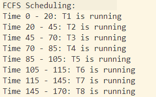
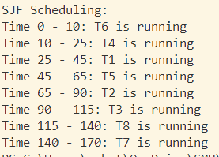
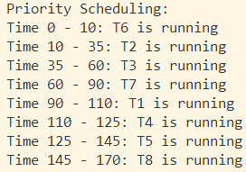
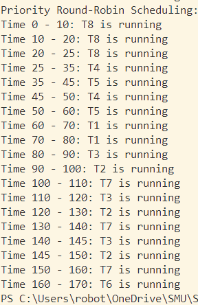
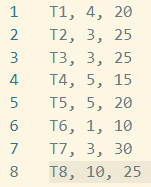

# Scheduling Algorithms

*March 24, 2024*

by Adwoa (Maggie) Asare

## Description

In this project I implemented 4 scheduling algorithms:

- First Come First Serve (FCFS)
- Shortest Job First (SJF)
- Priority Scheduling
- Round robin

The programs receives tasks to be scheduled from an input file called 'schedule.txt'. The input file includes one task per line in the format `[task name],[priority],[CPU burst]`

Each sorting algorithm has its own function in 'main.cpp' that takes a vector tasks objects as a parameter. The round robin function has an additional parameter for the Time Quantum.

## Installation

This project was run and compiled in **C++ 17** on Windows OS using the MinGW compiler and Visual Studio Code; however, it should also work on more modern versions of C++ once you compile it. Install the MinGW compiler and add it to your system's PATH. Detailed instruction on setting up the MinGW Compiler for VS Code are here: [Visual Studio Code C++ Documentation](https://code.visualstudio.com/docs/languages/cpp).

Download 'main.cpp' and 'schedule.txt' to the same directory.

## Usage

Once you have MinGW you can run the code by doing the following:

1. Open the terminal in Visual Studio Code. You can do this by going to the top menu and selecting View -> Terminal.

2. Navigate to the directory containing your main.cpp file. You can do this using the cd command followed by the directory path. For example, if your main.cpp file is in a folder named project on your desktop, you would type cd Desktop/project.

3. Compile the main.cpp file using the MinGW compiler. You can do this by typing `g++ -std=c++17 main.cpp -o main`. This command tells the compiler to compile main.cpp using C++17 standards and output a file named main.

4. Run the compiled program. You can do this by typing ./main. If the program requires command-line arguments or input files, include them after `./main`. 

### Output

The program will out put the FCFS, SJF, Priority, and Round Robin algorithms in that order. For each algorithm it will print the name of the scheduling algorithm and then the time units for which each task will run.

Out Put Formatting:

[Algorithm Name] Scheduling:

Time [start time] - [end time]: [task name] is running

## Examples

Some examples of my output are shown below.

### FCFS

### SJF

### Priority 

### Priority Round Robin

The priority round robin was run with a time quantum of 5.

### Input file: schedule.txt

I used the following schedule.txt for this example.

